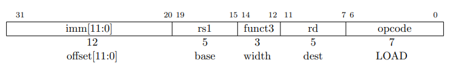

# Single cycle

A 32-bit RISC-V architecture will be implemented.

The microarchitecture can be divided into two interacting parts:
  1. Data-path: Contains structures such as memories, registers, ALUs, and
     multiplexers.
  2. Control-unit: Receives the current instruction from the data-path and produces
     multiplexer select, register enable, and memory write signals to control the
     operation of the data-path.

## State Elements

As a start, the hardware containing the state elements will be designed. These
elements include the memories and the architectural state (the program counter
and registers). Then, to compute the new state based on the current state blocks
of combinational logic between the state elements will be added.

Ignore the port names. **

### PC

The program counter (PC) consists of 32 flip flops (FF) that store the current
instruction and its input *nextPc*, indicates the address of the next instruction.

### Instruction Memory

The instruction memory has a single read port (simplification). It takes a 32-bit
instruction *address* input, and reads the 32-bit data from that address onto the
output, *instruction*.

### Register File

The register file consists of 32-registers of 32-bits each. It consists of two
*readAddress* ports that read data from the memory elements to their respective
*readData* ports. It also consists of a *writeAddress* port that *writeData* to
the memory element when *writeEnable* is asserted.

### Data Memory

The data memory has a single read/write address port, *rwAddress*. If its
*writeEnable* is asserted, then it *writesData* to the memory element on the
rising edge of the clock. If its write enable is 0, then it reads data from the
memory element to the *readData* port.

## Core Instructions

### LW

The load word (LW) I-type instruction is used for loading data from memory into
a register.

The instruction uses the signed 12-bit offset to calculate the memory address,
which is obtained by adding the offset to the value in the source register rs1.
The resulting memory address is then used to fetch the 32-bit word from memory
and store it in the destination register rd.
