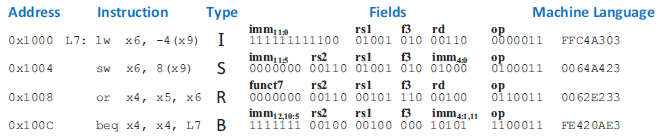
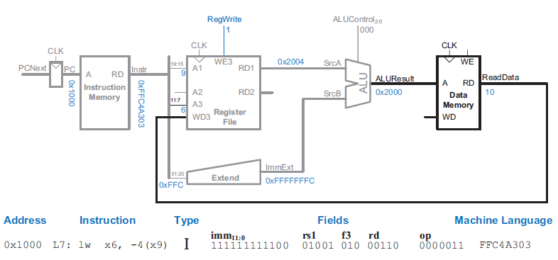
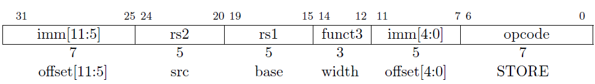
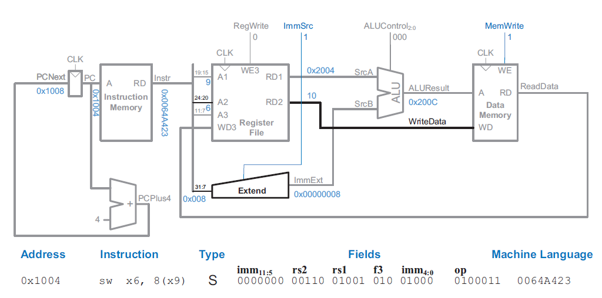

# Single cycle

A 32-bit RISC-V architecture will be implemented.

The microarchitecture can be divided into two interacting parts:
  1. Data-path: Contains structures such as memories, registers, ALUs, and
     multiplexers.
  2. Control-unit: Receives the current instruction from the data-path and produces
     multiplexer select, register enable, and memory write signals to control the
     operation of the data-path.

## State Elements

As a start, the hardware containing the state elements will be designed. These
elements include the memories and the architectural state (the program counter
and registers). Then, to compute the new state based on the current state blocks
of combinational logic between the state elements will be added.

Ignore the port names. **

### PC

The program counter (PC) consists of 32 flip flops (FF) that store the current
instruction and its input *nextPc*, indicates the address of the next instruction.

### Instruction Memory

The instruction memory has a single read port (simplification). It takes a 32-bit
instruction *address* input, and reads the 32-bit data from that address onto the
output, *instruction*.

### Register File

The register file consists of 32-registers of 32-bits each. It consists of two
*readAddress* ports that read data from the memory elements to their respective
*readData* ports. It also consists of a *writeAddress* port that *writeData* to
the memory element when *writeEnable* is asserted.

### Data Memory

The data memory has a single read/write address port, *rwAddress*. If its
*writeEnable* is asserted, then it *writesData* to the memory element on the
rising edge of the clock. If its write enable is 0, then it reads data from the
memory element to the *readData* port.

## Combinational logic

### Controller

A module consisting of a MUXes is used to decode the operand to determine the value
of control signals used to configure the state elements:
- A read/write from the register file is taking place.
- A read/write from the data memory is taking place.
- ALU logical operation.
- Which bits of the instruction contain the immediate field bits.

## Core Instructions

A top level module - *singleCycleTop_elaborated.sv* connects the state elements
to the combinational logic.

The following sample program exercises different types of instructions and it
will be used to guide the combinational logic connections.

### LW

The I-type instruction LW (Load Word) is utilized to fetch data from memory
and store it in a register.

The instruction takes the form of rd <= mem[rs1 + imm12], where the rs1 field
indicates the register containing the base address of the data memory. This
field is connected to the *i_readAddress1* port of the register file, while the
*o_readData1* port outputs the base address.

The 12-bit immediate field of the instruction is sign-extended to 32 bits, and
the ALU adds it to the base address to obtain the memory address from which to
read the data.

The destination register for the loaded data is specified in the rd field of
the instruction. This field is connected to the *i_writeAddress* port of the
register file, while the data to be saved in the register is connected to the
*i_writeData* port of the register file. During the execution of the LW instruction,
a control signal known as *i_regWrite* is connected to the *i_writeEnable* port and
is asserted.

Below is a schematic of the state elements and combinational logic connected to
implement the LW instruction.

### SW

The S-type instruction SW (Store Word) is used to store data from a register into
memory at a specified memory address.

The instruction takes the form of mem[rs1 + imm12] <= rs2, where the rs1 field
indicates the register containing the base address of the data memory. This
field is connected to the *i_readAddress1* port of the register file, while the
*o_readData1* port outputs the base address.

The 12-bit immediate field of the instruction is sign-extended to 32 bits, and
the ALU adds it to the base address to obtain the memory address to store the data.
This address is connected *i_rwAddress* of the data memory.

The source register containing the data to be stored is specified in the rs2 field
of the instruction. This field is connected to the *i_readAddress2* port of the
register file, and the data read is connected to the *i_writeData* port of the
data memory.

During the execution of the LW instruction, the control signal *i_regWrite* is 
deasserted since no register is being written to. Since, a memory write is taking
place, the memory *i_writEnable* signal is asserted.

Below is a schematic of the state elements and combinational logic connected to
implement the LW instruction.

