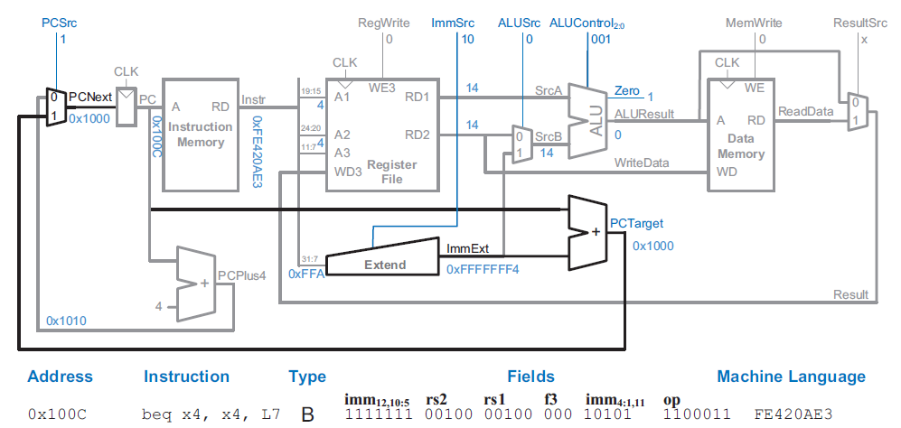

# Single cycle

A 32-bit RISC-V architecture is implemented.

The microarchitecture can be divided into two interacting parts:
  1. Data-path: Contains structures such as memories, registers, ALUs, and
     multiplexers.
  2. Control-unit: Receives the current instruction from the data-path and produces
     multiplexer select, register enable, and memory write signals to control the
     operation of the data-path.

## State Elements

As a start, the hardware containing the state elements will be designed. These
elements include the memories and the architectural state (the program counter
and registers). Then, to compute the new state based on the current state, blocks
of combinational logic between the state elements will be added.

Ignore the port names. **

### PC

The program counter (PC) consists of 32 flip flops (FF) that store the current
instruction. Its input *nextPc*, indicates the address of the next instruction.

### Instruction Memory

The instruction memory has a single read port (simplification). It takes a 32-bit
instruction, *i_address*, and reads the 32-bit data from that address onto the 
*o_instruction* port.

### Register File

The register file consists of 32-registers of 32-bits each. It consists of two *i_readAddressX* 
ports, that read data from the memory elements to their respective *o_readDataX* 
ports. It also consists of an *i_writeAddress* port, that writes data from the 
*i_writeData* port to the memory element when *i_writeEnable* is asserted.

### Data Memory

The data memory has a single read/write address port, *rwAddress*. If its
*writeEnable* is asserted, then it *writesData* to the memory element on the
rising edge of the clock. If its write enable is 0, then it reads data from the
memory element to the *readData* port.

## Combinational logic

### Controller

A module consisting of a MUXes is used to decode the instruction to assign the
value of control signals/select lines of combinational logic that are used to
control the data-path.

## Core Instructions

A top level module - *singleCycleTop_elaborated.sv* connects the state elements
to the combinational logic.

The following sample program exercises different types of instructions and it
will be used to guide the combinational logic connections.

### LW

The I-type instruction LW (Load Word) is utilized to fetch data from memory
and store it in a register.

The instruction takes the form of rd <= mem[rs1 + imm12], where the rs1 field
indicates the register containing the base address of the data memory. This
field is connected to the *i_readAddress1* port of the register file, while the
*o_readData1* port outputs the base address.

The 12-bit immediate field of the instruction is sign-extended to 32 bits, and
the ALU adds it to the base address to obtain the memory address from which to
read the data.

The destination register for the loaded data is specified in the rd field of
the instruction. This field is connected to the *i_writeAddress* port of the
register file, while the data to be saved in the register is connected to the
*i_writeData* port of the register file. During the execution of the LW instruction,
a control signal known as *i_regWrite* is connected to the *i_writeEnable* port and
is asserted.

Below is a schematic of the state elements and combinational logic connected to
implement the LW instruction.

### SW

The S-type instruction SW (Store Word) is used to store data from a register into
memory at a specified memory address.

The instruction takes the form of mem[rs1 + imm12] <= rs2, where the rs1 field
indicates the register containing the base address of the data memory. This
field is connected to the *i_readAddress1* port of the register file, while the
*o_readData1* port outputs the base address.

The 12-bit immediate field of the instruction is sign-extended to 32 bits, and
the ALU adds it to the base address to obtain the memory address to store the data.
This address is connected *i_rwAddress* of the data memory.

The source register containing the data to be stored is specified in the rs2 field
of the instruction. This field is connected to the *i_readAddress2* port of the
register file, and the data read is connected to the *i_writeData* port of the
data memory.

During the execution of the LW instruction, the control signal *i_regWrite* is
deasserted since no register is being written to. Since, a memory write is taking
place, the memory *i_writEnable* signal is asserted.

Below is a schematic of the state elements and combinational logic connected to
implement the LW instruction.

### R-Type

The R-type instruction is used for arithmetic and logical operations. The
instruction takes the form rd <= rs1 `op` rs2. The funct7 and funct3 fields select
the type of operation.

The rs1 and rs2 fields of the instruction are connected to the *i_readAddressX*
ports of the register file and the ALU performs an arithmentic/logical operation
on the data read from the registers. A multiplexer and a select signal *o_aluInputB*,
is used to select the input of *i_b* port of the ALU. For lw and sw instructions,
the output of the immediate extend block is selected. For R-type instructions,
the output of the register file, *o_readData2*, is selected.

As the output of the ALU has to be written to the register file (connected to the
*i_writeData* port) another multiplexer with a control signal, *resultSrc*, is
used. For R-Type instructions, the signal is deasserted and the ALU result is
selected. For I-Type instructions, the signal is asserted the output of the data
memory is selected. The output selected for S-Type instructions doesn't matter
since no register write takes place.

Below is a schematic of the state elements and combinational logic connected to
implement the R-Type instruction.

### B-Type

The B-Type instruction - BEQ (branch if equal) compares two registers rs1 and rs2.
If they are equal, the PC points to the *branchAddress*.

The branch offset is a 13-bit signed immediate stored in the 12-bit immediate
field of the B-type instruction. It is sign extended and added to the PC to
calculate the *branchAddress*.

The rs1 and rs2 ports are connected to the register file *i_readAddressX* ports
and the values read from the registers are subtracted from each other by the ALU.
If they are equal, the ALU *zeroFlag* will be asserted and this selects the
*branchAddress* as the next PC value.

Below is a schematic of the state elements and combinational logic connected to
implement the BEQ instruction.

### I-Type ALU

The I-type ALU instructions perform arithmetic and logical operations. The
instructions takes the form rd <= rs1 `op` immediate. The funct3 fields select
the type of operation.

The rs1 field is connected to the *i_readAddress1* ports of the register file and
the data read is one of the inputs to the ALU. The other input to the ALU is the
sign extended immediate field. The output of the ALU is connected to the
*i_writeData* port of the register file which is addressed by the rd field.

### JAL

The purpose of the J-Type instruction - JAL (Jump And Link), is to jump to a
target address obtained by PC + immediate and store the return address in the
register rd.

The immediate consists of 21 bits, where the LSB is always 0 and the remaining
bits are encoded in the instruction. The immediate is added to the pc and the
*nextPc* is assigned this address.

The current PC is incremented by 4 and is connected to the *regWriteData* port
of the register file. When the JAL instruction is decoded, a MUX selects *pcPlus4*
and is able to route the signal.

Below is a schematic of the state elements and combinational logic connected to
implement the JAL instruction.

